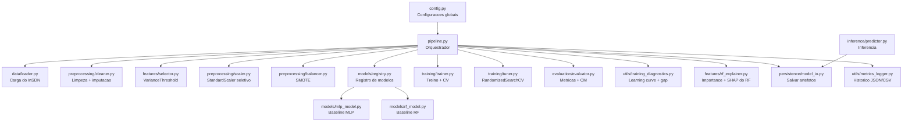
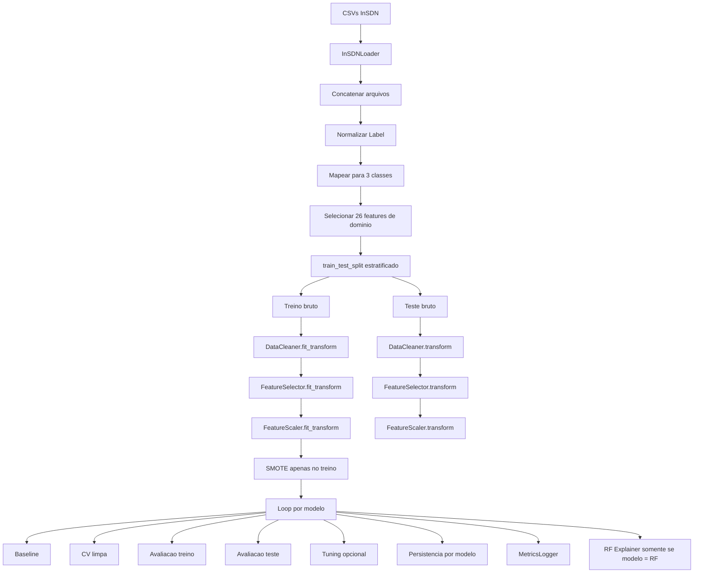
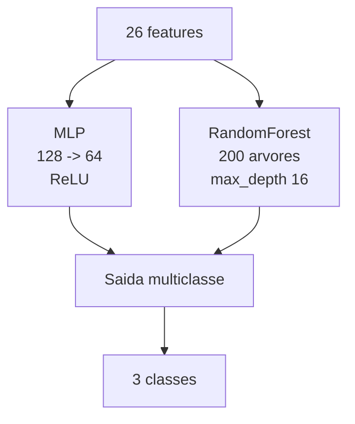

# Documentacao Tecnica do Modulo de Machine Learning

## Visao Geral

O diretorio `ml/` implementa um pipeline completo de classificacao multiclasse para trafego SDN com base no dataset `InSDN_DatasetCSV`.

O problema modelado e:

- `Normal`
- `Flooding`
- `Intrusao`

Mapeamento dos labels originais:

- `Normal -> Normal`
- `DoS -> Flooding`
- `DDoS -> Flooding`
- `Probe -> Intrusao`
- `BFA -> Intrusao`
- `Web-Attack -> Intrusao`
- `BOTNET -> Intrusao`
- `U2R -> Intrusao`

O pipeline hoje suporta dois modelos supervisionados:

- `MLPClassifier`
- `RandomForestClassifier`

A implementacao segue a ordem metodologica de [guia_boas_praticas_ml.md](/home/jv/sdn_ml_ddos_detection/docs/guia_boas_praticas_ml.md):

- `split` treino/teste antes de qualquer transformacao aprendida;
- `fit` de limpeza, imputacao, selecao e escala apenas no treino;
- `SMOTE` apenas no treino;
- validacao cruzada e learning curve com preprocessamento refeito em cada dobra;
- avaliacao separada em treino e teste para diagnostico de generalizacao;
- persistencia do modelo e dos transformadores fitados.

---

## Objetivo do Pacote `ml`

O modulo tem quatro responsabilidades principais:

1. carregar e consolidar o dataset bruto;
2. preparar os dados com um pipeline metodologicamente correto;
3. treinar, validar e avaliar um ou mais modelos;
4. salvar artefatos reutilizaveis para inferencia posterior.

Na pratica, ele transforma os CSVs do InSDN em:

- modelos treinados;
- transformadores de preprocessamento fitados;
- metricas e historico de experimentos;
- graficos de diagnostico;
- mecanismo de inferencia em novos fluxos.

---

## Estrutura do Pacote

```text
ml/
├── config.py
├── pipeline.py
├── data/
│   └── loader.py
├── preprocessing/
│   ├── cleaner.py
│   ├── scaler.py
│   └── balancer.py
├── features/
│   ├── selector.py
│   └── rf_explainer.py
├── models/
│   ├── mlp_model.py
│   ├── rf_model.py
│   └── registry.py
├── training/
│   ├── trainer.py
│   └── tuner.py
├── evaluation/
│   └── evaluator.py
├── persistence/
│   └── model_io.py
├── inference/
│   └── predictor.py
└── utils/
    ├── metrics_logger.py
    ├── metrics_plotter.py
    └── training_diagnostics.py
```

---

## Diagramas

## 1. Arquitetura Geral



## 2. Fluxo de Treinamento



## 3. Fluxo de Inferencia

```mermaid
graph TD
    A[Novos fluxos] --> B[DDoSPredictor]
    B --> C[ModelIO.load(model_name)]
    C --> D[Artefatos comuns + modelo escolhido]
    D --> E[Imputacao]
    E --> F[VarianceThreshold.transform]
    F --> G[Selecionar mesmas features]
    G --> H[Scaler.transform]
    H --> I[Model.predict / predict_proba]
    I --> J[Normal / Flooding / Intrusao]
```

## 4. Arquitetura dos Modelos



---

## Principios de Projeto

A refatoracao atual segue uma linha proxima de `SOLID`:

- `SRP`
  Cada modulo tem uma responsabilidade clara.
  `cleaner.py` limpa, `trainer.py` treina, `evaluator.py` avalia, `model_io.py` persiste.

- `OCP`
  O pipeline foi aberto para extensao via [registry.py](/home/jv/sdn_ml_ddos_detection/ml/models/registry.py).
  Para adicionar um novo modelo, o caminho principal e registrar um novo `ModelSpec`.

- `LSP`
  O treinamento, a avaliacao e os diagnosticos operam sobre estimadores compatíveis com a API do `scikit-learn`, sem depender de uma classe concreta.

- `ISP`
  As capacidades especificas foram separadas.
  Exemplo: explicabilidade ficou em [rf_explainer.py](/home/jv/sdn_ml_ddos_detection/ml/features/rf_explainer.py), nao no seletor geral.

- `DIP`
  O pipeline depende de abstracoes simples como `ModelSpec` e da interface comum dos estimadores sklearn, nao de detalhes internos de um unico modelo.

---

## Configuracao Central

Arquivo: [config.py](/home/jv/sdn_ml_ddos_detection/ml/config.py)

Principais grupos de configuracao:

- dataset e caminhos:
  - `DATASET_DIR`
  - `MODELS_DIR`
  - `OUTPUTS_DIR`
  - `OUTPUTS_RUNS_DIR`

- definicao do problema:
  - `CLASS_GROUP_MAPPING`
  - `TARGET_NAMES`
  - `TARGET_ENCODING`
  - `TARGET_DECODING`

- atributos de entrada:
  - `RELEVANT_FEATURES`
  - `BINARY_PASSTHROUGH_FEATURES`
  - `NON_NEGATIVE_FEATURES`

- preprocessamento:
  - `TEST_SIZE`
  - `VARIANCE_THRESHOLD`
  - `IMPUTER_STRATEGY`
  - `SMOTE_K_NEIGHBORS`

- modelos:
  - `MLP_*`
  - `RF_*`

- tuning:
  - `MLP_TUNING_PARAM_DISTRIBUTIONS`
  - `RF_TUNING_PARAM_DISTRIBUTIONS`

Decisao importante:
o projeto nao usa todas as colunas do dataset.
Ele parte de uma lista curada de `26` atributos estatisticos de fluxo para evitar memorizacao de identificadores de ambiente como IP, porta, `Flow ID` e `Timestamp`.

---

## Camada de Dados

Arquivo: [loader.py](/home/jv/sdn_ml_ddos_detection/ml/data/loader.py)

### Responsabilidade

O `InSDNLoader`:

- localiza os CSVs do InSDN;
- le e concatena os arquivos;
- normaliza os labels com `str.strip()`;
- aplica a engenharia de label para `Normal/Flooding/Intrusao`;
- filtra apenas as features de dominio;
- gera `X` e `y`.

### Entrada

- diretorio `dataset/InSDN_DatasetCSV`

### Saida

- `X`: `DataFrame` com as 26 features escolhidas mais `__row_hash__`
- `y`: `Series` com codigos inteiros das 3 classes

### Observacao sobre `__row_hash__`

Esse campo e usado internamente para detectar duplicatas reais na limpeza.
Ele nao entra no treinamento final, pois e removido pelo `DataCleaner`.

---

## Preprocessamento

## 1. Limpeza

Arquivo: [cleaner.py](/home/jv/sdn_ml_ddos_detection/ml/preprocessing/cleaner.py)

### O que faz

- troca `inf/-inf` por `NaN`;
- converte valores negativos impossiveis em `NaN` para features nao negativas;
- remove duplicatas reais no treino;
- ajusta `SimpleImputer` com mediana apenas no treino;
- aplica a mesma imputacao ao teste.

### Objetivo

Garantir consistencia numerica e evitar leakage.

## 2. Selecao de features

Arquivo: [selector.py](/home/jv/sdn_ml_ddos_detection/ml/features/selector.py)

### O que faz

- aplica `VarianceThreshold`;
- remove apenas features constantes.

### O que nao faz mais

- nao calcula SHAP;
- nao seleciona features supervisionadas por importancia.

Isso foi separado para manter o fluxo geral independente do modelo.

## 3. Escalonamento

Arquivo: [scaler.py](/home/jv/sdn_ml_ddos_detection/ml/preprocessing/scaler.py)

### O que faz

- identifica colunas binarias;
- preserva `0/1` sem padronizacao;
- aplica `StandardScaler` apenas nas colunas continuas;
- faz `fit` so no treino.

### Motivo

O `MLP` e sensivel a escala.
O `RF` nao precisa disso estritamente, mas usar o mesmo pipeline simplifica a arquitetura e mantem comparabilidade.

## 4. Balanceamento

Arquivo: [balancer.py](/home/jv/sdn_ml_ddos_detection/ml/preprocessing/balancer.py)

### O que faz

- aplica `SMOTE` somente no conjunto de treino.

### Motivo

Reduzir o impacto do desbalanceamento sem contaminar o conjunto de teste.

---

## Modelos

## 1. Registro de modelos

Arquivo: [registry.py](/home/jv/sdn_ml_ddos_detection/ml/models/registry.py)

### Papel

Centraliza o que varia entre os modelos:

- construtor baseline;
- nome de exibicao;
- nome do arquivo de persistencia;
- hiperparametros rastreados;
- espaco de tuning;
- capacidades especificas como `loss_curve` e explicabilidade.

### Modelos suportados

- `mlp`
- `rf`
- `both` no CLI para executar os dois na mesma run

## 2. MLP

Arquivo: [mlp_model.py](/home/jv/sdn_ml_ddos_detection/ml/models/mlp_model.py)

Baseline:

- `hidden_layer_sizes=(128, 64)`
- `activation='relu'`
- `solver='adam'`
- `alpha=0.001`
- `learning_rate='adaptive'`
- `early_stopping=True`

## 3. RandomForest

Arquivo: [rf_model.py](/home/jv/sdn_ml_ddos_detection/ml/models/rf_model.py)

Baseline:

- `n_estimators=200`
- `max_depth=16`
- `min_samples_split=4`
- `min_samples_leaf=2`
- `max_features='sqrt'`

---

## Treinamento

Arquivo: [trainer.py](/home/jv/sdn_ml_ddos_detection/ml/training/trainer.py)

### Responsabilidades

- treinar qualquer estimador compatível com sklearn;
- executar validacao cruzada limpa;
- opcionalmente salvar `loss_curve` quando o modelo a suporta.

### Funcao central de CV limpa

A funcao `fit_fold_pipeline()` recompõe, dentro de cada dobra:

1. limpeza;
2. selecao por variancia;
3. escalonamento;
4. SMOTE;
5. treino do modelo.

Isso garante que cada dobra seja um mini-experimento sem vazamento de dados.

### Observacao sobre loss curve

- `MLP`: suporta `loss_curve_`
- `RF`: nao suporta esse artefato e, por decisao de projeto, nao tentamos simular algo equivalente

---

## Tuning

Arquivo: [tuner.py](/home/jv/sdn_ml_ddos_detection/ml/training/tuner.py)

### O que faz

- encapsula `RandomizedSearchCV`;
- aceita qualquer estimador e qualquer `param_distributions`;
- usa `StratifiedKFold`;
- usa a metrica principal definida em `CV_SCORING`.

### Observacao

O tuning ficou generico.
Quem define o espaco de busca e o `ModelSpec` do modelo selecionado.

---

## Avaliacao

Arquivo: [evaluator.py](/home/jv/sdn_ml_ddos_detection/ml/evaluation/evaluator.py)

### Metricas calculadas

- `accuracy`
- `balanced_accuracy`
- `precision_macro`
- `recall_macro`
- `f1_macro`
- `f1_weighted`
- `mcc`
- `gm`
- `roc_auc_ovr_macro`

### Artefatos

- `classification_report`
- `confusion_matrix`
- plot da matriz de confusao

### Estrutura do resultado

O retorno e um `EvaluationResult`, que padroniza o contrato entre avaliacao, logging e diagnosticos.

---

## Diagnostico de Generalizacao

Arquivo: [training_diagnostics.py](/home/jv/sdn_ml_ddos_detection/ml/utils/training_diagnostics.py)

### O que faz

- gera `learning_curve`;
- gera `generalization_gap`;
- salva relatorio JSON com o gap treino vs teste.

### Como funciona

A learning curve usa o mesmo principio da CV limpa:
para cada tamanho de amostra e para cada dobra, o preprocessamento e reconstruido do zero.

Isso faz com que o grafico reflita o comportamento real do pipeline e nao apenas do estimador isolado.

---

## Explicabilidade do RandomForest

Arquivo: [rf_explainer.py](/home/jv/sdn_ml_ddos_detection/ml/features/rf_explainer.py)

### Escopo

Esse modulo existe apenas para o `RandomForest`.

### O que gera

- `feature importance` nativa do modelo;
- ranking `SHAP`, quando a biblioteca `shap` estiver instalada.

### Motivacao

Como o RF ja existe no pipeline para explicabilidade e sua estrutura em arvores e naturalmente interpretavel, a explicabilidade foi isolada nele em vez de permanecer acoplada a toda a selecao de features.

### Observacao importante

Se `shap` nao estiver instalado:

- o pipeline continua funcionando;
- apenas o ranking SHAP e pulado;
- a importance nativa do RF ainda e salva.

---

## Persistencia

Arquivo: [model_io.py](/home/jv/sdn_ml_ddos_detection/ml/persistence/model_io.py)

### Artefatos comuns

- `imputer.joblib`
- `variance_filter.joblib`
- `scaler.joblib`
- `selected_features.joblib`

### Artefatos por modelo

- `model_mlp.joblib`
- `model_rf.joblib`

### Motivacao

O preprocessamento e o mesmo para todos os modelos treinados na mesma configuracao.
Ja o estimador final varia.
Por isso a persistencia foi separada em:

- artefatos compartilhados;
- artefato especifico do modelo.

---

## Inferencia

Arquivo: [predictor.py](/home/jv/sdn_ml_ddos_detection/ml/inference/predictor.py)

### Como funciona

O `DDoSPredictor`:

- carrega os artefatos com `ModelIO`;
- recebe `model_name='mlp'` ou `model_name='rf'`;
- reaplica o preprocessamento do treino na mesma ordem;
- executa `predict`, `predict_proba` ou `predict_with_confidence`.

### Pipeline de inferencia

1. entrada em `DataFrame`
2. tratamento de `inf/NaN`
3. imputacao
4. `VarianceThreshold.transform`
5. reordenacao das features esperadas
6. `scaler.transform`
7. predição do modelo carregado

---

## Orquestracao do Pipeline

Arquivo: [pipeline.py](/home/jv/sdn_ml_ddos_detection/ml/pipeline.py)

### Funcao principal

`run_pipeline()`

### Etapas

1. cria a pasta da run em `outputs/runs/<run_id>`;
2. carrega o dataset;
3. executa EDA opcional;
4. faz `train_test_split` estratificado;
5. limpa treino e aplica a mesma limpeza ao teste;
6. executa selecao por variancia;
7. escalona as features;
8. aplica SMOTE no treino;
9. resolve os modelos requisitados pelo argumento `--model`;
10. executa um loop por modelo:
   - baseline
   - CV limpa
   - avaliacao treino/teste
   - learning curve
   - gap de generalizacao
   - tuning opcional
   - explicabilidade, se RF
   - persistencia
   - logging

### Modelos aceitos no CLI

- `--model mlp`
- `--model rf`
- `--model both`

---

## Historico e Visualizacao

## 1. Registro persistente

Arquivo: [metrics_logger.py](/home/jv/sdn_ml_ddos_detection/ml/utils/metrics_logger.py)

### O que salva

- `run_id`
- `label`
- `timestamp`
- metricas
- matriz de confusao
- parametros
- metadados do dataset
- observacoes

### Saidas

- `outputs/metrics_history.json`
- `outputs/metrics_history.csv`

## 2. Plots de historico

Arquivo: [metrics_plotter.py](/home/jv/sdn_ml_ddos_detection/ml/utils/metrics_plotter.py)

### O que faz

- lista runs;
- plota evolucao das metricas;
- compara duas runs;
- gera radar chart;
- revisita a matriz de confusao salva no historico;
- gera dashboard agregado.

---

## Como Executar

## Rodar apenas MLP

```bash
python3 -m ml.pipeline --model mlp --no-tuning --run-id mlp_full
```

## Rodar apenas RandomForest

```bash
python3 -m ml.pipeline --model rf --no-tuning --run-id rf_full
```

## Rodar ambos

```bash
python3 -m ml.pipeline --model both --no-tuning --run-id comparativo_full
```

## Rodar experimento rapido

```bash
python3 -m ml.pipeline --model both --no-tuning --no-eda --sample-size 12000 --run-id rapido
```

---

## Como Ler os Artefatos Gerados

Dentro de `outputs/runs/<run_id>/` podem aparecer:

- `loss_curve_mlp_baseline.png`
- `learning_curve_mlp_baseline.png`
- `learning_curve_rf_baseline.png`
- `generalization_gap_*.png`
- `generalization_report_*.json`
- `confusion_matrix_*.png`
- `rf_feature_importance_*.png`
- `rf_shap_importance_*.png` se `shap` estiver instalado

Interpretacao geral:

- `loss_curve`: apenas MLP; mostra convergencia do treino
- `learning_curve`: compara score de treino e validacao por volume de dados
- `generalization_gap`: compara treino vs teste
- `confusion_matrix`: mostra os tipos de erro por classe
- `rf_feature_importance`: mostra quais atributos mais influenciaram o RF

---

## Fluxo de Extensao para Novos Modelos

Para adicionar um novo modelo ao projeto, o caminho esperado e:

1. criar o construtor baseline em `ml/models/`;
2. registrar o modelo em [registry.py](/home/jv/sdn_ml_ddos_detection/ml/models/registry.py);
3. definir:
   - `key`
   - `display_name`
   - `persistence_filename`
   - `tracked_params`
   - `param_distributions`
   - capacidades especificas
4. opcionalmente criar um modulo especializado, se houver explicabilidade ou diagnostico exclusivos.

Como `trainer`, `tuner`, `evaluator`, `model_io` e `pipeline` ja operam de forma generica, esse processo tende a exigir pouca alteracao fora do registro.

---

## Limitacoes Atuais

- o preprocessamento continua unico para todos os modelos na mesma configuracao;
- o `RF` nao possui loss curve, por decisao deliberada;
- o SHAP do RF depende da instalacao da biblioteca `shap`;
- a persistencia comum assume que os modelos comparados compartilham as mesmas features selecionadas e o mesmo scaler;
- o tuning foi generalizado, mas ainda depende de espacos de busca definidos manualmente em `config.py`.

---

## Resumo Arquitetural

Em termos de implementacao, o projeto hoje funciona assim:

- um unico pipeline de dados;
- multiplos modelos supervisionados plugaveis;
- preprocessamento compartilhado e metodologicamente seguro;
- avaliacao, logging e diagnosticos reutilizaveis;
- explicabilidade especializada apenas onde faz sentido, no `RandomForest`.

Essa arquitetura permite comparar `MLP` e `RF` sem duplicar a maior parte do codigo, mantendo coerencia metodologica e reduzindo acoplamento desnecessario.
