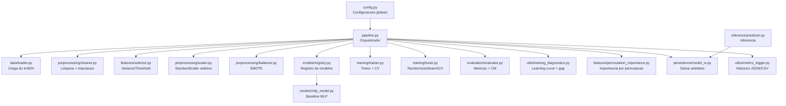
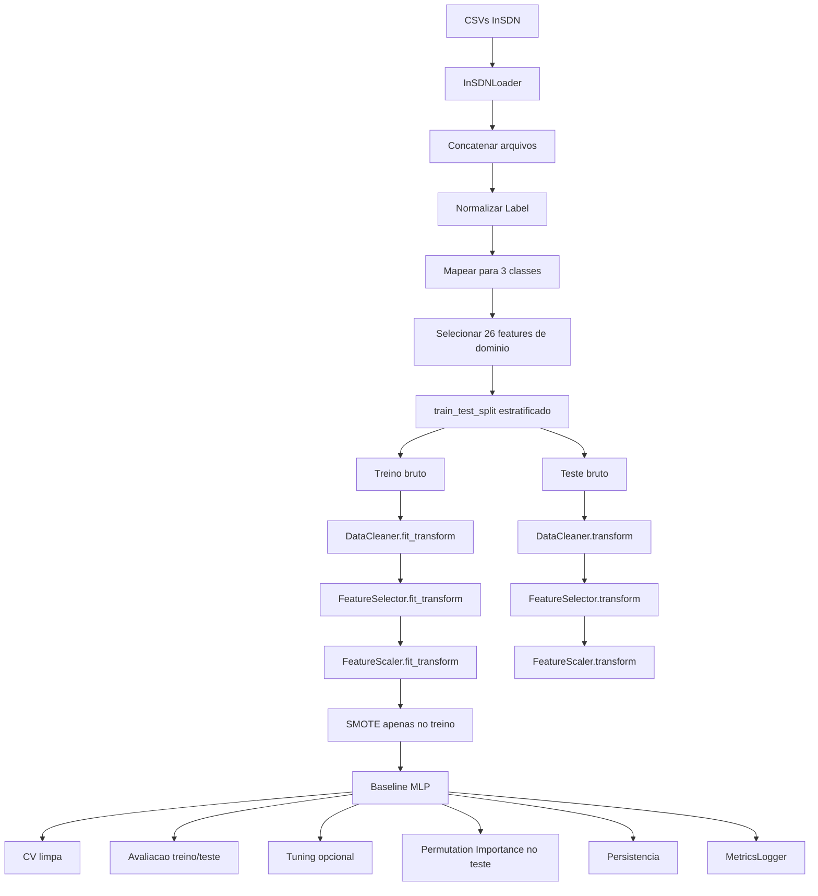
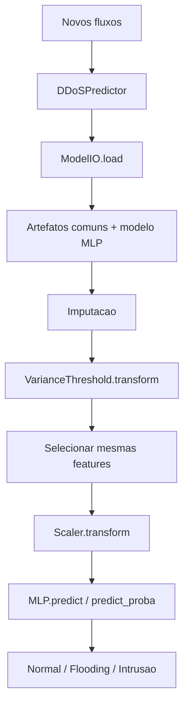
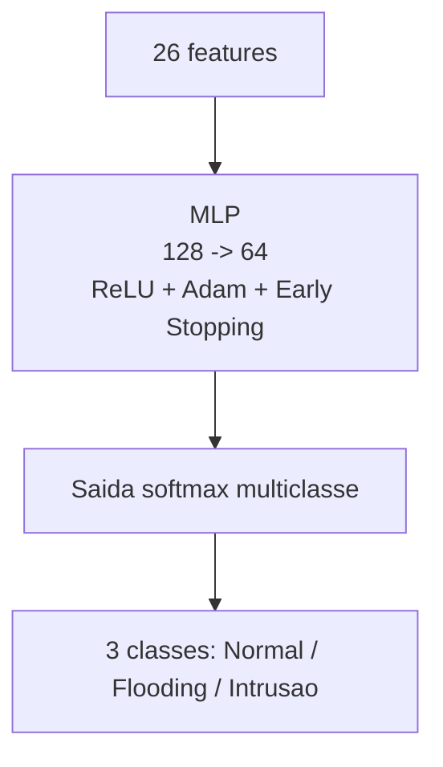

# Documentacao Tecnica do Modulo de Machine Learning

## Visao Geral

O diretorio `ml/` implementa um pipeline completo de classificacao multiclasse para trafego SDN com base no dataset `InSDN_DatasetCSV`.

O problema modelado e:

- `Normal`
- `Flooding`
- `Intrusao`

Mapeamento dos labels originais:

- `Normal -> Normal`
- `DoS -> Flooding`
- `DDoS -> Flooding`
- `Probe -> Intrusao`
- `BFA -> Intrusao`
- `Web-Attack -> Intrusao`
- `BOTNET -> Intrusao`
- `U2R -> Intrusao`

O modelo supervisionado utilizado e o `MLPClassifier` (Rede Neural Multicamada).

A implementacao segue a ordem metodologica de [guia_boas_praticas_ml.md](/home/jv/sdn_ml_ddos_detection/docs/guia_boas_praticas_ml.md):

- `split` treino/teste antes de qualquer transformacao aprendida;
- `fit` de limpeza, imputacao, selecao e escala apenas no treino;
- `SMOTE` apenas no treino;
- validacao cruzada e learning curve com preprocessamento refeito em cada dobra;
- avaliacao separada em treino e teste para diagnostico de generalizacao;
- permutation importance calculada no conjunto de teste para interpretabilidade real;
- persistencia do modelo e dos transformadores fitados.

---

## Objetivo do Pacote `ml`

O modulo tem quatro responsabilidades principais:

1. carregar e consolidar o dataset bruto;
2. preparar os dados com um pipeline metodologicamente correto;
3. treinar, validar, avaliar e interpretar o MLP;
4. salvar artefatos reutilizaveis para inferencia posterior.

Na pratica, ele transforma os CSVs do InSDN em:

- modelo treinado;
- transformadores de preprocessamento fitados;
- metricas e historico de experimentos;
- graficos de diagnostico;
- ranking de permutation importance por feature;
- mecanismo de inferencia em novos fluxos.

---

## Estrutura do Pacote

```text
ml/
├── config.py
├── pipeline.py
├── data/
│   └── loader.py
├── preprocessing/
│   ├── cleaner.py
│   ├── scaler.py
│   └── balancer.py
├── features/
│   ├── selector.py
│   └── permutation_importance.py
├── models/
│   ├── mlp_model.py
│   └── registry.py
├── training/
│   ├── trainer.py
│   └── tuner.py
├── evaluation/
│   └── evaluator.py
├── persistence/
│   └── model_io.py
├── inference/
│   └── predictor.py
└── utils/
    ├── metrics_logger.py
    ├── metrics_plotter.py
    └── training_diagnostics.py
```

---

## Diagramas

## 1. Arquitetura Geral



## 2. Fluxo de Treinamento



## 3. Fluxo de Inferencia



## 4. Arquitetura do Modelo



---

## Principios de Projeto

A implementacao segue os principios `SOLID`:

- `SRP`
  Cada modulo tem uma responsabilidade clara.
  `cleaner.py` limpa, `trainer.py` treina, `evaluator.py` avalia,
  `permutation_importance.py` interpreta, `model_io.py` persiste.

- `OCP`
  O pipeline e aberto para extensao via [registry.py](/home/jv/sdn_ml_ddos_detection/ml/models/registry.py).
  Para adicionar um novo modelo, basta registrar um novo `ModelSpec`.
  A flag `supports_permutation_importance` no `ModelSpec` controla
  quais modelos executam a analise de importancia.

- `LSP`
  O treinamento, a avaliacao e os diagnosticos operam sobre estimadores
  compativeis com a API do `scikit-learn`, sem depender de uma classe concreta.

- `ISP`
  Capacidades especificas foram separadas em modulos proprios.
  A interpretabilidade ficou em `permutation_importance.py`, desacoplada
  do seletor de features e do modelo em si.

- `DIP`
  O pipeline depende de abstracoes simples como `ModelSpec` e da interface
  comum dos estimadores sklearn, nao de detalhes internos de um unico modelo.

---

## Configuracao Central

Arquivo: [config.py](/home/jv/sdn_ml_ddos_detection/ml/config.py)

Principais grupos de configuracao:

- dataset e caminhos:
  - `DATASET_DIR`
  - `MODELS_DIR`
  - `OUTPUTS_DIR`
  - `OUTPUTS_RUNS_DIR`

- definicao do problema:
  - `CLASS_GROUP_MAPPING`
  - `TARGET_NAMES`
  - `TARGET_ENCODING`
  - `TARGET_DECODING`

- atributos de entrada:
  - `RELEVANT_FEATURES`
  - `BINARY_PASSTHROUGH_FEATURES`
  - `NON_NEGATIVE_FEATURES`

- preprocessamento:
  - `TEST_SIZE`
  - `VARIANCE_THRESHOLD`
  - `IMPUTER_STRATEGY`
  - `SMOTE_K_NEIGHBORS`

- modelo MLP:
  - `MLP_*`

- tuning:
  - `MLP_TUNING_PARAM_DISTRIBUTIONS`

- permutation importance:
  - `PERMUTATION_IMPORTANCE_N_REPEATS`
  - `PERMUTATION_IMPORTANCE_SCORING`

Decisao importante:
o projeto nao usa todas as colunas do dataset.
Ele parte de uma lista curada de `26` atributos estatisticos de fluxo para evitar memorizacao
de identificadores de ambiente como IP, porta, `Flow ID` e `Timestamp`.

---

## Camada de Dados

Arquivo: [loader.py](/home/jv/sdn_ml_ddos_detection/ml/data/loader.py)

### Responsabilidade

O `InSDNLoader`:

- localiza os CSVs do InSDN;
- le e concatena os arquivos;
- normaliza os labels com `str.strip()`;
- aplica a engenharia de label para `Normal/Flooding/Intrusao`;
- filtra apenas as features de dominio;
- gera `X` e `y`.

### Entrada

- diretorio `dataset/InSDN_DatasetCSV`

### Saida

- `X`: `DataFrame` com as 26 features escolhidas mais `__row_hash__`
- `y`: `Series` com codigos inteiros das 3 classes

### Observacao sobre `__row_hash__`

Esse campo e usado internamente para detectar duplicatas reais na limpeza.
Ele nao entra no treinamento final, pois e removido pelo `DataCleaner`.

---

## Preprocessamento

## 1. Limpeza

Arquivo: [cleaner.py](/home/jv/sdn_ml_ddos_detection/ml/preprocessing/cleaner.py)

### O que faz

- troca `inf/-inf` por `NaN`;
- converte valores negativos impossiveis em `NaN` para features nao negativas;
- remove duplicatas reais no treino;
- ajusta `SimpleImputer` com mediana apenas no treino;
- aplica a mesma imputacao ao teste.

### Objetivo

Garantir consistencia numerica e evitar leakage.

## 2. Selecao de features

Arquivo: [selector.py](/home/jv/sdn_ml_ddos_detection/ml/features/selector.py)

### O que faz

- aplica `VarianceThreshold`;
- remove apenas features constantes.

Essa selecao e supervisionada apenas pela variancia, sem usar a saida do modelo.
A importancia supervisionada (quais features pesam mais para o MLP) e calculada
separadamente pelo `PermutationImportanceAnalyzer`.

## 3. Escalonamento

Arquivo: [scaler.py](/home/jv/sdn_ml_ddos_detection/ml/preprocessing/scaler.py)

### O que faz

- identifica colunas binarias;
- preserva `0/1` sem padronizacao;
- aplica `StandardScaler` apenas nas colunas continuas;
- faz `fit` so no treino.

### Motivo

O `MLP` e sensivel a escala.
Escalonar apenas as colunas continuas evita distorcer features binarias como `SYN Flag Cnt`.

## 4. Balanceamento

Arquivo: [balancer.py](/home/jv/sdn_ml_ddos_detection/ml/preprocessing/balancer.py)

### O que faz

- aplica `SMOTE` somente no conjunto de treino.

### Motivo

Reduzir o impacto do desbalanceamento sem contaminar o conjunto de teste.

---

## Modelo

## Registro de modelos

Arquivo: [registry.py](/home/jv/sdn_ml_ddos_detection/ml/models/registry.py)

### Papel

Centraliza o que varia entre os modelos:

- construtor baseline;
- nome de exibicao;
- nome do arquivo de persistencia;
- hiperparametros rastreados;
- espaco de tuning;
- capacidades especificas: `loss_curve` e `permutation_importance`.

### Modelos suportados

- `mlp`

### Extensibilidade

Para adicionar um novo modelo ao projeto:

1. criar o construtor baseline em `ml/models/`;
2. registrar o modelo em `registry.py` com um novo `ModelSpec`;
3. definir as capacidades: `supports_loss_curve`, `supports_permutation_importance`.

Como `trainer`, `tuner`, `evaluator`, `model_io` e `pipeline` operam de forma generica,
a adicao de um novo modelo requer pouca alteracao fora do registro.

## MLP

Arquivo: [mlp_model.py](/home/jv/sdn_ml_ddos_detection/ml/models/mlp_model.py)

Baseline:

- `hidden_layer_sizes=(128, 64)` — duas camadas ocultas
- `activation='relu'`
- `solver='adam'`
- `alpha=0.001` — regularizacao L2
- `learning_rate='adaptive'`
- `early_stopping=True` — interrompe se a validacao interna parar de melhorar

---

## Treinamento

Arquivo: [trainer.py](/home/jv/sdn_ml_ddos_detection/ml/training/trainer.py)

### Responsabilidades

- treinar qualquer estimador compativel com sklearn;
- executar validacao cruzada limpa;
- salvar `loss_curve` quando o modelo a suporta.

### Funcao central de CV limpa

A funcao `fit_fold_pipeline()` recompoe, dentro de cada dobra:

1. limpeza;
2. selecao por variancia;
3. escalonamento;
4. SMOTE;
5. treino do modelo.

Isso garante que cada dobra seja um mini-experimento sem vazamento de dados.

### Observacao sobre loss curve

O MLP suporta `loss_curve_` nativo, que e salvo e plotado automaticamente.

---

## Tuning

Arquivo: [tuner.py](/home/jv/sdn_ml_ddos_detection/ml/training/tuner.py)

### O que faz

- encapsula `RandomizedSearchCV`;
- aceita qualquer estimador e qualquer `param_distributions`;
- usa `StratifiedKFold`;
- usa a metrica principal definida em `CV_SCORING`.

### Observacao

O espaco de busca e definido no `ModelSpec` do modelo selecionado, em `config.py`.

---

## Avaliacao

Arquivo: [evaluator.py](/home/jv/sdn_ml_ddos_detection/ml/evaluation/evaluator.py)

### Metricas calculadas

- `accuracy`
- `balanced_accuracy`
- `precision_macro`
- `recall_macro`
- `f1_macro`
- `f1_weighted`
- `mcc`
- `gm`
- `roc_auc_ovr_macro`

### Artefatos

- `classification_report`
- `confusion_matrix`
- plot da matriz de confusao

### Estrutura do resultado

O retorno e um `EvaluationResult`, que padroniza o contrato entre avaliacao, logging e diagnosticos.

---

## Interpretabilidade: Permutation Importance

Arquivo: [permutation_importance.py](/home/jv/sdn_ml_ddos_detection/ml/features/permutation_importance.py)

### O que e

Permutation importance mede a contribuicao de cada feature embaralhando
aleatoriamente seus valores e observando a queda no score do modelo.
Funciona com qualquer estimador — incluindo o MLP — sem depender de
estrutura interna (como arvores ou gradientes).

### Por que no conjunto de TESTE

A importancia e calculada no conjunto de teste (nao no treino) para refletir
quais features sao genuinamente uteis para a generalizacao do modelo,
e nao apenas para o ajuste nos dados de treino.
Calcular no treino pode superestimar features que o modelo memorizou.

### O que gera

- ranking de features por queda media em `f1_macro` (com desvio padrao por repeticao);
- grafico de barras horizontal com intervalo de incerteza (`mean ± std`);
- CSV com o ranking completo para analise posterior.

### Interpretacao

- `importance_mean > 0`: a feature contribui positivamente para o modelo;
- `importance_mean ≈ 0`: a feature nao influencia o desempenho;
- `importance_mean < 0`: embaralhar a feature melhora o score (possivelmente ruido ou correlacao espuria).

### Parametros configurados em config.py

```python
PERMUTATION_IMPORTANCE_N_REPEATS: int = 10   # repeticoes por feature
PERMUTATION_IMPORTANCE_SCORING: str = "f1_macro"  # metrica de referencia
```

Mais repeticoes (`N_REPEATS`) dao estimativas mais estaveis ao custo de tempo de execucao.

### Como rodar separadamente (sem reprocessar o pipeline todo)

O `PermutationImportanceAnalyzer` pode ser instanciado e chamado com um
modelo ja salvo e dados ja pre-processados. Veja a secao
"Rodando Permutation Importance Isoladamente" mais abaixo.

---

## Diagnostico de Generalizacao

Arquivo: [training_diagnostics.py](/home/jv/sdn_ml_ddos_detection/ml/utils/training_diagnostics.py)

### O que faz

- gera `learning_curve`;
- gera `generalization_gap`;
- salva relatorio JSON com o gap treino vs teste.

### Como funciona

A learning curve usa o mesmo principio da CV limpa:
para cada tamanho de amostra e para cada dobra, o preprocessamento e reconstruido do zero.

Isso faz com que o grafico reflita o comportamento real do pipeline e nao apenas do estimador isolado.

---

## Persistencia

Arquivo: [model_io.py](/home/jv/sdn_ml_ddos_detection/ml/persistence/model_io.py)

### Artefatos comuns

- `imputer.joblib`
- `variance_filter.joblib`
- `scaler.joblib`
- `selected_features.joblib`

### Artefato do modelo

- `model_mlp.joblib`

### Motivacao

O preprocessamento e compartilhado por todos os modelos treinados na mesma configuracao.
O estimador final e salvo separadamente.

---

## Inferencia

Arquivo: [predictor.py](/home/jv/sdn_ml_ddos_detection/ml/inference/predictor.py)

### Como funciona

O `DDoSPredictor`:

- carrega os artefatos com `ModelIO`;
- recebe `model_name='mlp'`;
- reaplica o preprocessamento do treino na mesma ordem;
- executa `predict`, `predict_proba` ou `predict_with_confidence`.

### Pipeline de inferencia

1. entrada em `DataFrame`
2. tratamento de `inf/NaN`
3. imputacao
4. `VarianceThreshold.transform`
5. reordenacao das features esperadas
6. `scaler.transform`
7. predicao do MLP carregado

---

## Orquestracao do Pipeline

Arquivo: [pipeline.py](/home/jv/sdn_ml_ddos_detection/ml/pipeline.py)

### Funcao principal

`run_pipeline()`

### Etapas

1. cria a pasta da run em `outputs/runs/<run_id>`;
2. carrega o dataset;
3. executa EDA opcional;
4. faz `train_test_split` estratificado;
5. limpa treino e aplica a mesma limpeza ao teste;
6. executa selecao por variancia;
7. escalona as features;
8. aplica SMOTE no treino;
9. treina o MLP baseline + CV limpa;
10. avalia treino/teste, plota learning curve e gap de generalizacao;
11. tuning opcional;
12. permutation importance no conjunto de teste (opcional via `--no-permutation-importance`);
13. persistencia dos artefatos e logging.

### Parametros CLI

| Flag | Efeito |
|---|---|
| `--no-tuning` | Pula o hyperparameter tuning |
| `--no-eda` | Pula a EDA textual |
| `--no-permutation-importance` | Pula a analise de importancia por permutacao |
| `--run-id <id>` | Identificador da execucao |
| `--sample-size <n>` | Usa amostra estratificada para experimento rapido |
| `--model mlp` | Modelo a executar (unica opcao atual) |

---

## Como Executar

### Execucao completa (com permutation importance)

```bash
python3 -m ml.pipeline --no-tuning --run-id mlp_full
```

### Execucao rapida (sem EDA, sem tuning, sem permutation importance)

```bash
python3 -m ml.pipeline --no-tuning --no-eda --no-permutation-importance \
  --sample-size 12000 --run-id rapido
```

### Execucao com tuning + permutation importance

```bash
python3 -m ml.pipeline --run-id mlp_tuned
```

### Visualizar historico de runs

```bash
python3 -m ml.utils.metrics_plotter --list
python3 -m ml.utils.metrics_plotter --dashboard
python3 -m ml.utils.metrics_plotter --compare baseline_full tuned_full
```

---

## Rodando Permutation Importance Isoladamente

Se o modelo ja foi treinado e salvo em `models/`, e possivel rodar a
permutation importance sem re-executar o pipeline inteiro:

```python
import pandas as pd
import numpy as np
from ml.persistence.model_io import ModelIO
from ml.features.permutation_importance import PermutationImportanceAnalyzer

# 1. Carregar modelo e artefatos salvos
artifacts = ModelIO().load(model_name="mlp")

# 2. Preparar X_test e y_test (ja pre-processados — mesmas transformacoes do treino)
#    Exemplo: se voce tem os dados brutos, aplique:
#    - cleaner.transform()
#    - selector.transform()
#    - scaler.transform()
#    Ou reutilize as variaveis do pipeline se estiver em sessao ativa.

# 3. Rodar a analise
analyzer = PermutationImportanceAnalyzer(output_dir="outputs/permutation_importance")
importance_df = analyzer.analyze(
    model=artifacts.model,
    X_test=X_test_scaled,   # DataFrame com as features ja escalonadas
    y_test=y_test.values,   # array com os rotulos numericos
    label="mlp_pos_treino",
)
print(importance_df)
```

Nao e necessario rodar o pipeline todo.
O `PermutationImportanceAnalyzer` precisa apenas de:
- o modelo treinado (`.predict` e `.score` compativeis com sklearn);
- o conjunto de teste pre-processado (mesmas transformacoes do treino);
- os rotulos correspondentes.

---

## Como Ler os Artefatos Gerados

Dentro de `outputs/runs/<run_id>/` aparecem:

| Arquivo | Descricao |
|---|---|
| `loss_curve_mlp_baseline.png` | Convergencia do treino (loss por epoca) |
| `learning_curve_mlp_baseline.png` | Score treino vs validacao por volume de dados |
| `generalization_gap_*.png` | Comparacao treino vs teste para cada metrica |
| `generalization_report_*.json` | Gap numericamente tabelado |
| `confusion_matrix_*.png` | Tipos de erro por classe |
| `permutation_importance_mlp_*.png` | Importancia de cada feature para o MLP (mean ± std) |
| `permutation_importance_mlp_*.csv` | Ranking completo exportado |

---

## Historico e Visualizacao

## 1. Registro persistente

Arquivo: [metrics_logger.py](/home/jv/sdn_ml_ddos_detection/ml/utils/metrics_logger.py)

### O que salva

- `run_id`
- `label`
- `timestamp`
- metricas
- matriz de confusao
- parametros
- metadados do dataset
- observacoes

### Saidas

- `outputs/metrics_history.json`
- `outputs/metrics_history.csv`

## 2. Plots de historico

Arquivo: [metrics_plotter.py](/home/jv/sdn_ml_ddos_detection/ml/utils/metrics_plotter.py)

### O que faz

- lista runs;
- plota evolucao das metricas;
- compara duas runs;
- gera radar chart;
- revisita a matriz de confusao salva no historico;
- gera dashboard agregado.

---

## Limitacoes Atuais

- o preprocessamento e unico para todos os modelos na mesma configuracao;
- a permutation importance pode ser lenta em datasets grandes com muitas features (tempo linear em `n_features * n_repeats` chamadas de predicao);
- a persistencia comum assume que os modelos comparados compartilham as mesmas features selecionadas e o mesmo scaler;
- o tuning foi generalizado, mas ainda depende de espacos de busca definidos manualmente em `config.py`.

---

## Resumo Arquitetural

Em termos de implementacao, o projeto funciona assim:

- um unico pipeline de dados metodologicamente correto;
- MLP como unico estimador supervisionado;
- preprocessamento compartilhado e seguro contra data leakage;
- avaliacao, logging e diagnosticos reutilizaveis;
- interpretabilidade via permutation importance, calculada no teste, independente do modelo.

Essa arquitetura e extensivel via `ModelSpec`: adicionar um novo modelo
nao requer alterar o pipeline principal, apenas registrar o novo spec.
