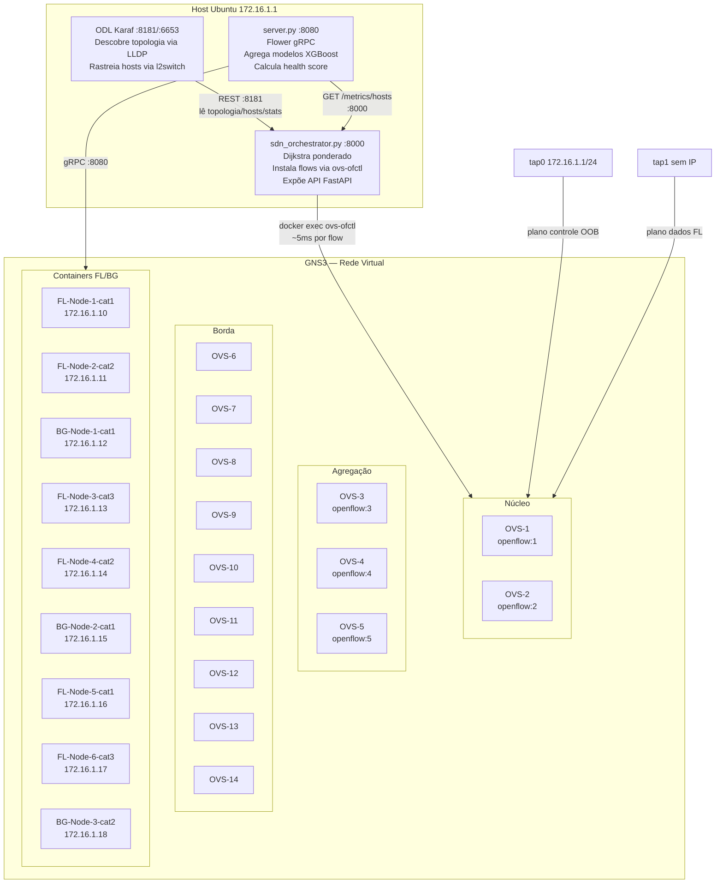
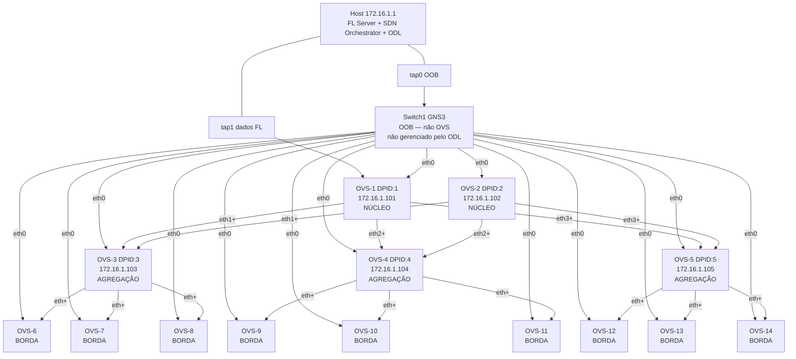
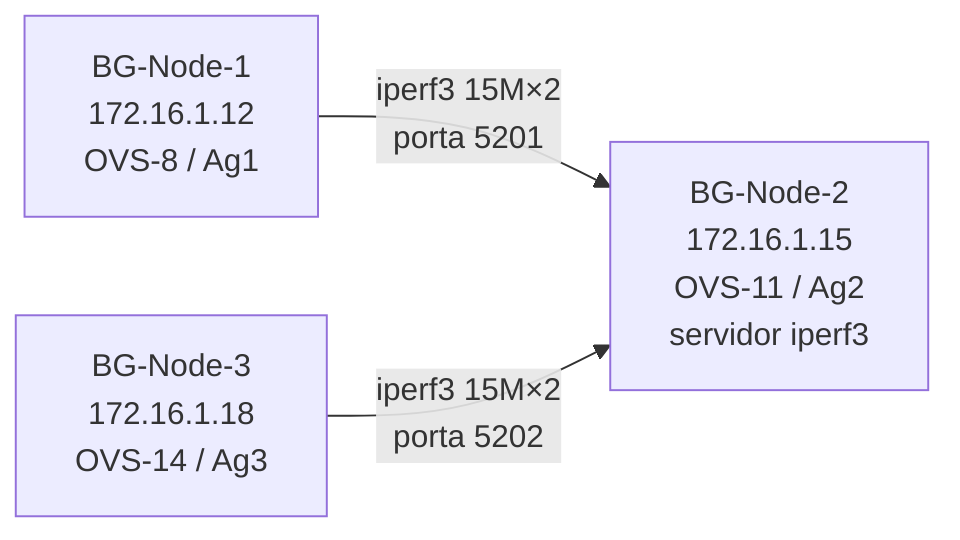
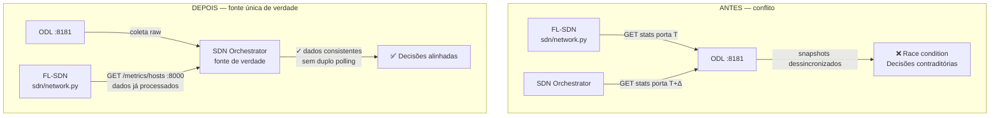
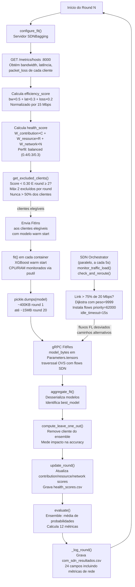
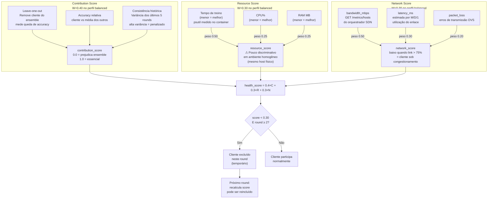

# Documentação Completa — Experimento FL-SDN v2
## Nova Topologia Hierárquica + Estratégia sdn-bagging com Health Score

**Laboratório:** LUMO-UFPB  
**Data:** Março 2026  
**Stack:** ODL Calcium SR3 · Open vSwitch (GNS3 Docker) · Flower FL · XGBoost · FastAPI · Python 3.12

---

## Sumário

1. [Visão Geral do Sistema](#1-visão-geral-do-sistema)
2. [Nova Topologia de Rede](#2-nova-topologia-de-rede)
3. [Arquitetura do Código](#3-arquitetura-do-código)
4. [Fluxo Completo de um Round FL com Health Score](#4-fluxo-completo-de-um-round-fl-com-health-score)
5. [Bloqueio Dinâmico de Clientes](#5-bloqueio-dinâmico-de-clientes)
6. [Passo a Passo — Setup do Ambiente](#6-passo-a-passo--setup-do-ambiente)
7. [Comandos de Execução do Experimento](#7-comandos-de-execução-do-experimento)
8. [Diferenças em Relação à Topologia Anterior](#8-diferenças-em-relação-à-topologia-anterior)

---

## 1. Visão Geral do Sistema

O experimento mede o impacto do SDN na convergência do Federated Learning em condições de congestionamento. São três projetos independentes que colaboram:



**Separação de planos:**
- **tap0** → plano de controle: ODL usa para OpenFlow (porta 6653) e REST (porta 8181)
- **tap1** → plano de dados: clientes FL enviam modelos via gRPC para o servidor

---

## 2. Nova Topologia de Rede

### 2.1 Hierarquia de switches



### 2.2 Mapa completo dos hosts de borda

| OVS | DPID | IP Gerência | Tier | Host Conectado | IP Host | Cat. | Papel | Client-ID |
|---|---|---|---|---|---|---|---|---|
| OVS-1 | 1 | 172.16.1.101 | Núcleo | — | — | — | Encaminhamento | — |
| OVS-2 | 2 | 172.16.1.102 | Núcleo | — | — | — | Encaminhamento | — |
| OVS-3 | 3 | 172.16.1.103 | Agregação | — | — | — | Encaminhamento | — |
| OVS-4 | 4 | 172.16.1.104 | Agregação | — | — | — | Encaminhamento | — |
| OVS-5 | 5 | 172.16.1.105 | Agregação | — | — | — | Encaminhamento | — |
| OVS-6 | 6 | 172.16.1.106 | Borda | FL-Node-1-cat1 | 172.16.1.10 | cat1 | **Cliente FL** | 0 |
| OVS-7 | 7 | 172.16.1.107 | Borda | FL-Node-2-cat2 | 172.16.1.11 | cat2 | **Cliente FL** | 2 |
| OVS-8 | 8 | 172.16.1.108 | Borda | BG-Node-1-cat1 | 172.16.1.12 | cat1 | **BG gerador** | — |
| OVS-9 | 9 | 172.16.1.109 | Borda | FL-Node-3-cat3 | 172.16.1.13 | cat3 | **Cliente FL** | 4 |
| OVS-10 | 10 | 172.16.1.110 | Borda | FL-Node-4-cat2 | 172.16.1.14 | cat2 | **Cliente FL** | 3 |
| OVS-11 | 11 | 172.16.1.111 | Borda | BG-Node-2-cat1 | 172.16.1.15 | cat1 | **BG receptor** | — |
| OVS-12 | 12 | 172.16.1.112 | Borda | FL-Node-5-cat1 | 172.16.1.16 | cat1 | **Cliente FL** | 1 |
| OVS-13 | 13 | 172.16.1.113 | Borda | FL-Node-6-cat3 | 172.16.1.17 | cat3 | **Cliente FL** | 5 |
| OVS-14 | 14 | 172.16.1.114 | Borda | BG-Node-3-cat2 | 172.16.1.18 | cat2 | **BG gerador** | — |

### 2.3 Estratégia de congestionamento



Dois geradores em grupos de agregação diferentes apontando para o mesmo receptor. Os fluxos de background percorrem **Ag1→Core→Ag2** e **Ag3→Core→Ag2**, saturando os uplinks de núcleo — exatamente os caminhos que o tráfego FL também precisa usar para chegar ao servidor em 172.16.1.1.

---

## 3. Arquitetura do Código

### 3.1 Repositórios e responsabilidades

```mermaid
graph TD
    subgraph SDN["sdn-project-main/ — SDN Orchestrator"]
        SDN_MAIN["sdn_orchestrator.py\nEntrypoint — inicia FastAPI + loop de controle"]
        SDN_CFG["orchestrator/config.py\nMAX_LINK_CAPACITY=20Mbps\nROUTE_THRESH=75%\nDOCKER_NAME_PREFIX=GNS3.OVS-"]
        SDN_DOMAIN["domain/state.py\nNetworkState — estado global\ngraph, hosts_by_mac, link_load\nblocked_ips, active_flows"]
        SDN_TOPO["application/topology.py\nDijkstra ponderado\nflows base TABLE-MISS/LLDP/BDDP"]
        SDN_HOSTS["application/hosts.py\nDescoberta via l2switch ODL\nARP probing a cada 6 ciclos"]
        SDN_TRAFFIC["application/traffic.py\nMonitoramento de bps por enlace\nAtualiza link_load a cada 5s"]
        SDN_ROUTING["application/routing.py\nInstala flows IPv4 proativos\nReroute com idle_timeout=15s"]
        SDN_API["presentation/api.py\nGET /metrics/hosts\nGET /metrics/links\nPOST /manage/ip block/unblock"]
        SDN_OVS["infrastructure/ovs_adapter.py\ndocker exec ovs-ofctl ~5ms\nThreadPoolExecutor max_workers=20"]
    end

    subgraph FL["fl-node/ — FL Original (experimentos base)"]
        FL_SERVER["fl_simple_demo/server.py\nFlower gRPC :8080\nSimpleBagging / SimpleCycling"]
        FL_CLIENT["fl_simple_demo/client.py\nXGBoost warm start\nPickle serialização"]
        FL_CFG["fl_simple_demo/config.py\nNUM_CLIENTS=6\nLOCAL_EPOCHS_BY_CAT"]
    end

    subgraph FLSDN["FL-SDN-main/ — FL Evoluído"]
        FLSDN_SERVER["fl_sdn_code/server.py\nSDNBagging / SDNCycling\nConsulta /metrics/hosts"]
        FLSDN_CLIENT["fl_sdn_code/client.py\nResourceMonitor CPU/RAM\n12 métricas de avaliação"]
        FLSDN_HEALTH["fl_sdn_code/core/health_score.py\nClientHealthTracker\n4 perfis de pesos\nLeave-one-out"]
        FLSDN_NETWORK["fl_sdn_code/sdn/network.py\nGET /metrics/hosts do orquestrador\ncalcula efficiency_score"]
        FLSDN_CONTROLLER["fl_sdn_code/sdn/controller.py\nHTTP client para :8000\nnão fala com ODL diretamente"]
        FLSDN_CFG["fl_sdn_code/config.py\nSDN_ORCHESTRATOR_IP\nSDN_MIN_BANDWIDTH_MBPS=15\nSDN_ADAPTIVE_EPOCHS=False"]
    end

    SDN_API -->|"expõe dados já processados"| FLSDN_NETWORK
    FLSDN_CONTROLLER -->|"GET :8000"| SDN_API
    FL_SERVER -->|"gRPC :8080"| FL_CLIENT
    FLSDN_SERVER -->|"gRPC :8080"| FLSDN_CLIENT
```



### 3.2 Por que o FL-SDN não fala com o ODL diretamente



---

## 4. Fluxo Completo de um Round FL com Health Score



---

## 5. Bloqueio Dinâmico de Clientes

O sistema de health score não bloqueia clientes na rede — ele os **exclui temporariamente do round FL**. São três dimensões independentes:



### Regras de exclusão

| Regra | Valor padrão | Motivo |
|---|---|---|
| Rounds mínimos antes de excluir | 2 | Histórico insuficiente nos primeiros rounds |
| Threshold de exclusão | 0.30 | Abaixo disso o cliente prejudica mais do que contribui |
| Máximo de excluídos por round | 2 | Evita degradar o ensemble por falta de diversidade |
| Proteção de quorum | 50% | Nunca exclui mais da metade dos clientes elegíveis |

### Exemplo real do experimento anterior

No round 6, o cliente 1 foi excluído com `contribution_score=0.0` — o leave-one-out mostrou que o ensemble ficava melhor sem ele. No round 9, três exclusões simultâneas (clientes 3, 4 e o sistema aplicou a regra de quorum automaticamente limitando a 2).

---

## 6. Passo a Passo — Setup do Ambiente

### 6.1 Configurar os switches OVS

```bash
sudo bash ~/Downloads/setup_switch.sh
```

**O que faz:** itera sobre todos os containers Docker com nome `GNS3.OVS-N`, entra em cada um e executa:
- `ifconfig eth0 172.16.1.1XX` — configura IP de gerência (plano de controle OOB)
- `ovs-vsctl add-br br0` — cria a bridge OpenFlow
- `ovs-vsctl set bridge br0 other-config:datapath-id=$DPID` — DPID fixo para que o ODL sempre reconheça o mesmo switch
- `ovs-vsctl set-controller br0 tcp:172.16.1.1:6653` — registra o ODL como controlador
- `ovs-vsctl set bridge br0 protocols=OpenFlow13 fail-mode=secure` — OpenFlow 1.3, descarta pacotes se ODL desconectar
- `ovs-vsctl set bridge br0 other-config:disable-in-band=true` — evita flows ocultos de gerenciamento que conflitariam com os flows do orquestrador

**Por que DPID fixo:** sem DPID fixo, o OVS gera um DPID aleatório a cada reinicialização. O ODL registraria o switch como `openflow:XXXXXXXXX` diferente a cada boot, e o orquestrador perderia o mapeamento container→switch.

### 6.2 Configurar plano de dados e hosts de borda

```bash
sudo ./setup_experimento.sh
```

**O que faz nos passos relevantes:**

**PASSO 5 — tc tbf nos OVS:**
```bash
nsenter -t $PID -n tc qdisc add dev eth$i root tbf rate 20mbit burst 32kbit latency 10ms
```
`nsenter` entra no namespace de rede do container e executa o `tc` do host. Aplica Token Bucket Filter em todas as `eth1..eth15` de cada OVS (não em `eth0` que é o plano de controle). Sem isso, as interfaces teriam capacidade ilimitada e o congestionamento não seria observável.

**PASSO 6 — Configura containers de borda:**
```bash
sysctl -w net.ipv6.conf.all.disable_ipv6=1  # evita flood NDP no ODL
ip addr add 172.16.1.XX/24 dev eth0          # IP estático
ip route add default via 172.16.1.1          # rota para o servidor FL
ping -c 2 172.16.1.1                         # força ARP → ODL descobre o host
```

**Por que IPv6 desabilitado:** o l2switch do ODL trata pacotes NDP (Neighbor Discovery Protocol do IPv6) como novos hosts, preenchendo a tabela com endereços `fe80::` inúteis. Isso polui os logs e aumenta o tráfego de controle.

**Por que o ping é necessário:** o l2switch descobre hosts capturando ARP requests. Sem o ping, o ODL não mapeia `IP → MAC → switch → porta` e o orquestrador não consegue calcular rotas Dijkstra para aquele host.

### 6.3 Copiar o código FL-SDN para os containers

```bash
cd ~/FL-SDN-main
tar czf /tmp/fl_sdn_code.tar.gz \
    --exclude='fl_sdn_code/data' \
    --exclude='fl_sdn_code/output' \
    --exclude='fl_sdn_code/__pycache__' \
    fl_sdn_code/
```

**Por que excluir `data/` e `output/`:** os arquivos `.npy` do dataset Higgs têm 5.4 MB cada. Com 9 containers, copiar os dados aumentaria o tar de ~1 MB para ~650 MB desnecessariamente — os dados já existem em `/fl/data/` dentro de cada container desde a build da imagem `fl-node:latest`.

```bash
for container in $(sudo docker ps --format '{{.Names}}' | grep -E 'FL-Node|BG-Node'); do
    docker cp /tmp/fl_sdn_code.tar.gz "$container":/tmp/
    docker exec "$container" bash -c "cd /fl && tar xzf /tmp/fl_sdn_code.tar.gz"
done
```

**Por que `docker cp` e não volume mount:** os containers GNS3 não são criados com volumes — são containers efêmeros que o GNS3 gerencia. A única forma de inserir arquivos é via `docker cp` após o container estar rodando.

```bash
for container in $(sudo docker ps --format '{{.Names}}' | grep -E 'FL-Node|BG-Node'); do
    docker exec "$container" bash -c "
        mkdir -p /fl/fl_sdn_code/data
        ln -sf /fl/data/higgs_X.npy /fl/fl_sdn_code/data/higgs_X.npy
        ln -sf /fl/data/higgs_y.npy /fl/fl_sdn_code/data/higgs_y.npy
    "
done
```

**Por que symlink e não cópia:** o `fl_sdn_code/datasets/higgs.py` procura os `.npy` em `fl_sdn_code/data/`. Criar symlinks apontando para `/fl/data/` evita duplicar 11 MB de dados por container sem copiar os arquivos fisicamente.

### 6.4 Atualizar config.py e propagar

```bash
# Após editar ~/FL-SDN-main/fl_sdn_code/config.py
for container in $(sudo docker ps --format '{{.Names}}' | grep -E 'FL-Node|BG-Node'); do
    docker cp ~/FL-SDN-main/fl_sdn_code/config.py \
        "$container":/fl/fl_sdn_code/config.py
done
```

**Por que propagar o config:** cada cliente FL lê `config.py` para saber `NUM_CLIENTS`, `CLIENT_CATEGORIES`, `CLIENT_CONNECT_ADDRESS` e `SDN_CLIENT_IPS`. Se o config estiver desatualizado, o cliente tenta fazer download do dataset via internet (sem DNS nos containers) ou usa um número errado de clientes para o particionamento do dataset.

---

## 7. Comandos de Execução do Experimento

### Sequência completa

```bash
# ── Terminal 1: Orquestrador SDN ──────────────────────────────────────────
cd ~/sdn-project-main && source venv/bin/activate
python3 sdn_orchestrator.py
# Aguardar: "OK: 14 switches | XX enlaces"
# Aguardar: "9 host(s) conhecido(s)"

# ── Terminal 2: Servidor FL ───────────────────────────────────────────────
cd ~/FL-SDN-main/fl_sdn_code && source ~/fl-node/venv/bin/activate
EXP=com_sdn python3 server.py --model xgboost --strategy sdn-bagging
# Aguardar: "Aguardando 6 cliente(s) conectarem..."

# ── BG-Node-2-cat1 (172.16.1.15) — servidor iperf3 ───────────────────────
iperf3 -s -D          # porta padrão 5201 (daemon)
iperf3 -s -p 5202 -D  # segunda porta para segundo gerador

# ── BG-Node-1-cat1 (172.16.1.12) — gerador de congestionamento ───────────
iperf3 -c 172.16.1.15 -p 5201 -t 9999 -b 15M -P 2 &
# 2 fluxos × 15 Mbps = 30 Mbps tentados em link de 20 Mbps

# ── BG-Node-3-cat2 (172.16.1.18) — segundo gerador ───────────────────────
iperf3 -c 172.16.1.15 -p 5202 -t 9999 -b 15M -P 2 &
# Fluxo via Ag3 → Core → Ag2, caminho diferente do BG-Node-1

# ── 6 Clientes FL (após servidor aguardar conexões) ──────────────────────

# FL-Node-1-cat1 (172.16.1.10) — client-id 0, cat1, 50 épocas
python3 /fl/fl_sdn_code/client.py --client-id 0 --model xgboost

# FL-Node-5-cat1 (172.16.1.16) — client-id 1, cat1, 50 épocas
python3 /fl/fl_sdn_code/client.py --client-id 1 --model xgboost

# FL-Node-2-cat2 (172.16.1.11) — client-id 2, cat2, 100 épocas
python3 /fl/fl_sdn_code/client.py --client-id 2 --model xgboost

# FL-Node-4-cat2 (172.16.1.14) — client-id 3, cat2, 100 épocas
python3 /fl/fl_sdn_code/client.py --client-id 3 --model xgboost

# FL-Node-3-cat3 (172.16.1.13) — client-id 4, cat3, 150 épocas
python3 /fl/fl_sdn_code/client.py --client-id 4 --model xgboost

# FL-Node-6-cat3 (172.16.1.17) — client-id 5, cat3, 150 épocas
python3 /fl/fl_sdn_code/client.py --client-id 5 --model xgboost
```

### Experimento SEM SDN (controle)

```bash
# Parar orquestrador (Ctrl+C)
# Limpar flows de reroute
cd ~/sdn-project-main && python3 sdn_tools.py clean

# Rodar servidor sem SDN
EXP=sem_sdn python3 server.py --model xgboost --strategy bagging
# Manter background traffic e clientes FL iguais
```

### Analisar resultados após os experimentos

```bash
cd ~/FL-SDN-main/fl_sdn_code

# Exclusões por cliente
python3 -c "
import pandas as pd, glob
df = pd.read_csv(glob.glob('output/*/health_scores.csv')[0])
print(df[df.excluded].groupby('client_id').size())
print(df[df.excluded][['round','client_id','health_score','contribution_score','network_score']])
"

# Gráficos comparativos
python3 plot_resultados.py \
    --com output/*/com_sdn_resultados.csv \
    --sem output/*/sem_sdn_resultados.csv
```

---

## 8. Diferenças em Relação à Topologia Anterior

| Aspecto | Topologia v1 (10 OVS flat) | Topologia v2 (14 OVS hierárquica) |
|---|---|---|
| Switches | 10 (sem hierarquia) | 14 (2 núcleo + 3 agregação + 9 borda) |
| Redundância | Links entre switches de mesmo nível | Uplinks duplos Ag→Core |
| Hosts por switch | 1-2 hosts por switch de borda | 1 host por switch de borda |
| Hosts totais | 8 (6 FL + 2 BG) | 9 (6 FL + 3 BG) |
| Background traffic | 2 fluxos mesmo caminho | 2 fluxos caminhos diferentes (Ag1 e Ag3) |
| Congestionamento | Localizado em poucos links | Distribuído em múltiplos uplinks |
| Caminhos alternativos | Limitados pela topologia flat | Múltiplos via Core1↔Core2 |
| IPs hosts | 172.16.1.20-.100 | 172.16.1.10-.18 |
| Start command OVS | `/usr/share/openvswitch/scripts/ovs-ctl start && tail -f /dev/null` | vazio (usa CMD da imagem: `/etc/openvswitch/init.sh; bash`) |
| Prefixo Docker | `GNS3.OpenvSwitchLocal-` | `GNS3.OVS-` |
| FL utilizado | `fl_simple_demo/` (simples) | `fl_sdn_code/` (com health score) |
| Estratégia FL | `bagging` | `sdn-bagging` |
| Métricas CSV | 7 colunas | 24 colunas (+ recursos + rede) |
| Arquivos de saída | `com_sdn_resultados.csv` | `com_sdn_resultados.csv` + `health_scores.csv` + `sdn_metricas.csv` |

---

*Documentação gerada para o experimento FL-SDN v2 — Topologia hierárquica 2-3-9 — LUMO-UFPB 2026.*